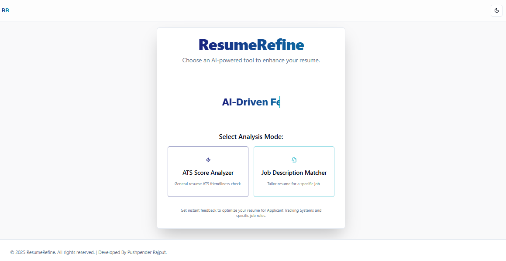
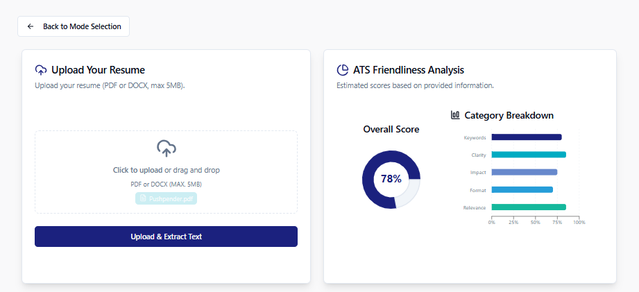
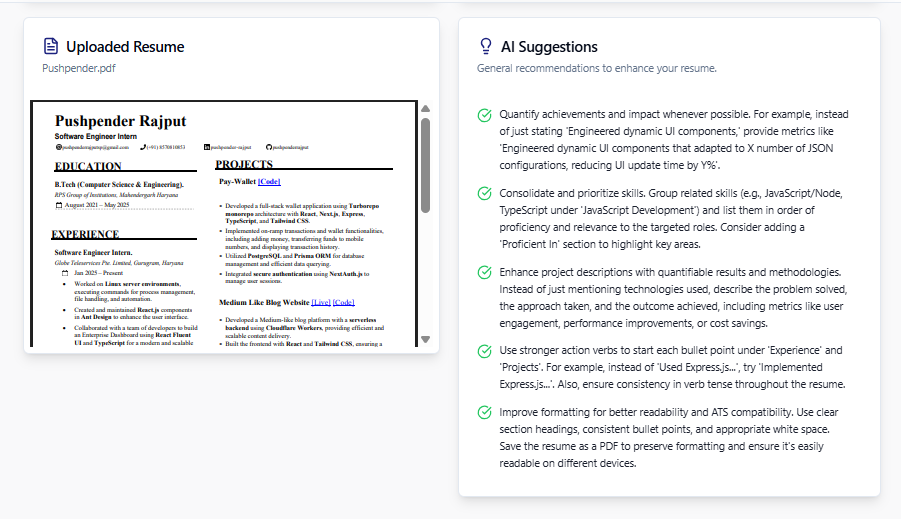

# 📄 ResumeRefine

**AI-powered resume analysis and optimization platform.**  
Helps users enhance their resumes to match specific job descriptions and improve their chances of passing Applicant Tracking Systems (ATS).

🔗 **Live Demo:** [resumerefined.netlify.app](https://resumerefined.netlify.app)

---

## ✨ Features

- 🔍 **ATS Score Analyzer**  
  Evaluate your resume’s compatibility with common ATS algorithms.

- 🎯 **Job Description Matcher**  
  Compare your resume with job descriptions to improve relevance and targeting.

- 🧠 **AI-Enhanced Suggestions**  
  Uses AI to suggest improvements based on resume content and job requirements.

- 📎 **Clean and Intuitive Interface**  
  Built with modern UI/UX best practices using Tailwind CSS.

---

## 🛠 Tech Stack

| Technology       | Role                         |
|------------------|------------------------------|
| **Next.js**      | Framework (React-based)      |
| **TypeScript**   | Static typing                |
| **Tailwind CSS** | Styling                      |
| **Netlify**      | Deployment                   |
| **AI APIs**      | Resume analysis & matching   |

---

## 📷 Screenshots

> Add actual screenshots in the `public/screenshots/` folder and update these links.

### 🔹 Home Page


### 🔹 Resume Upload & ATS Score


### 🔹 AI Insights


---

## 🚀 Getting Started

### Prerequisites

- Node.js (>=18.x)
- npm or yarn

### Installation

```bash
git clone https://github.com/pushpenderrajput/ResumeRefine.git
cd ResumeRefine
npm install
